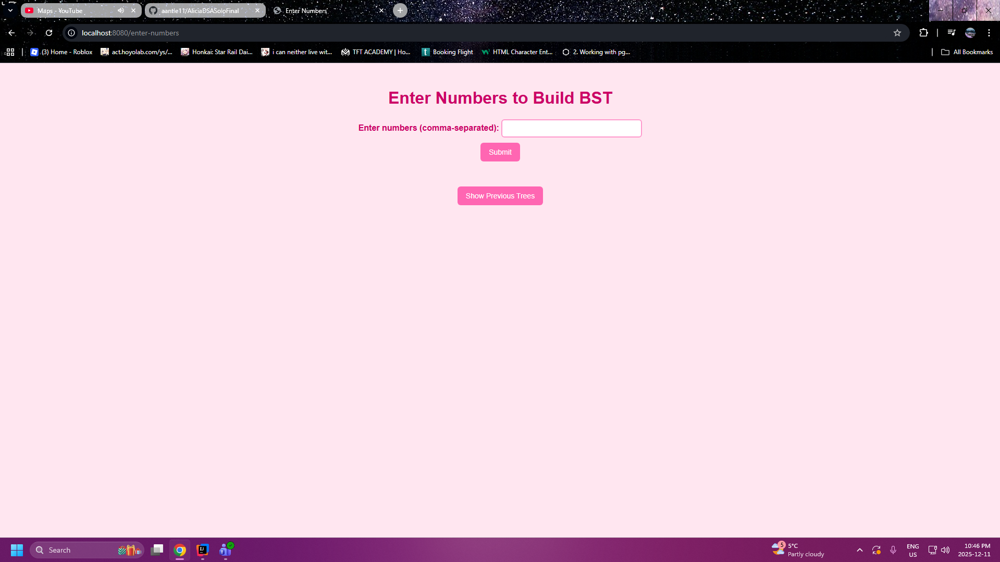
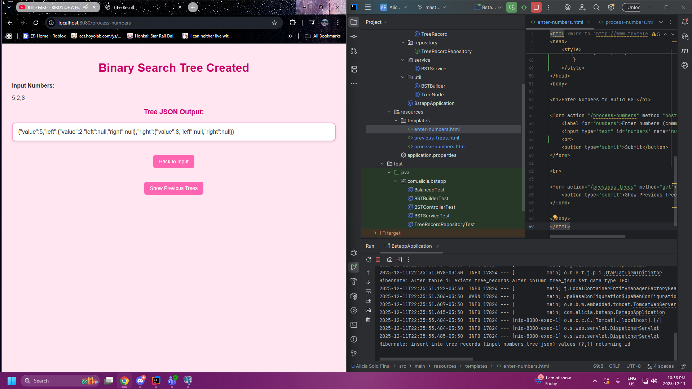
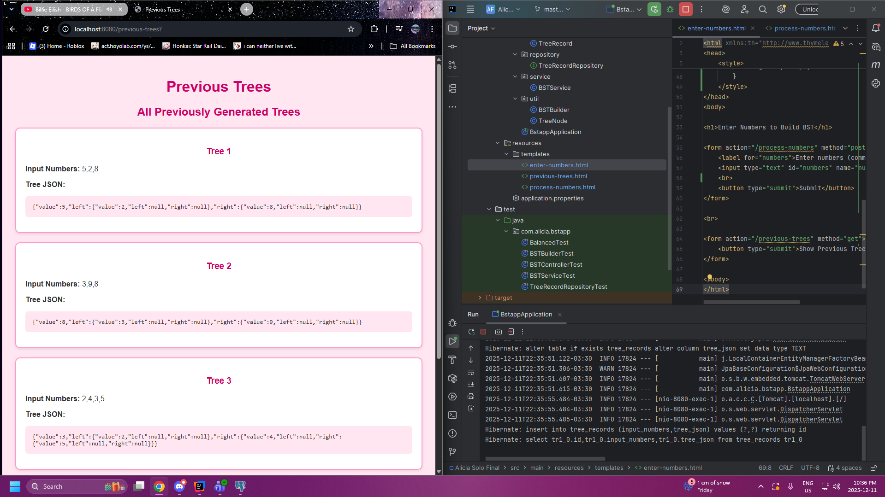
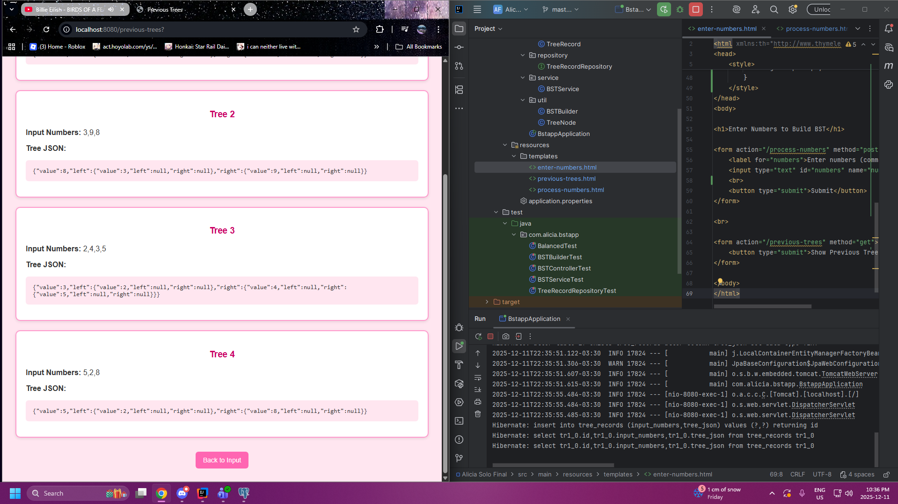

Alicia - Semester 4 Final Sprint
Data Structures and Algorithms

Spring Boot Application that allows users to create
a binary search tree from a series of numbers, vizualize
the resulting tree, and view previous trees.

Screenshots provided below

## Enter Numbers Input Form

## Tree Output

## Previous Trees Page

## Back To Input ( Enter Numbers ) Button
